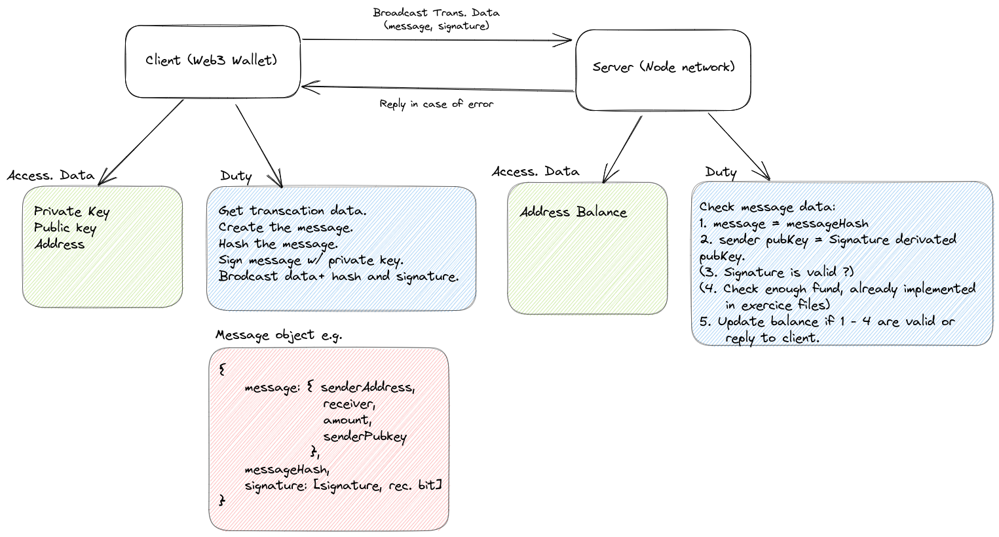

## ECDSA Node

This project is an example of using a client and server to facilitate transfers between different addresses. Since there is just a single server on the back-end handling transfers, this is clearly very centralized. We won't worry about distributed consensus for this project.

However, something that we would like to incoporate is Public Key Cryptography. By using Elliptic Curve Digital Signatures we can make it so the server only allows transfers that have been signed for by the person who owns the associated address.

### Video instructions
For an overview of this project as well as getting started instructions, check out the following video:

https://www.loom.com/share/0d3c74890b8e44a5918c4cacb3f646c4
 
### Client

The client folder contains a [react app](https://reactjs.org/) using [vite](https://vitejs.dev/). To get started, follow these steps:

1. Open up a terminal in the `/client` folder
2. Run `npm install` to install all the depedencies
3. Run `npm run dev` to start the application 
4. Now you should be able to visit the app at http://127.0.0.1:5173/

### Server

The server folder contains a node.js server using [express](https://expressjs.com/). To run the server, follow these steps:

1. Open a terminal within the `/server` folder 
2. Run `npm install` to install all the depedencies 
3. Run `node index` to start the server 

The application should connect to the default server port (3042) automatically! 

_Hint_ - Use [nodemon](https://www.npmjs.com/package/nodemon) instead of `node` to automatically restart the server on any changes.

### Note from student

For this project, I first thought about the logic I wanted to implement. For this, I made the high level chart below that I used as a reference for the programation. 

